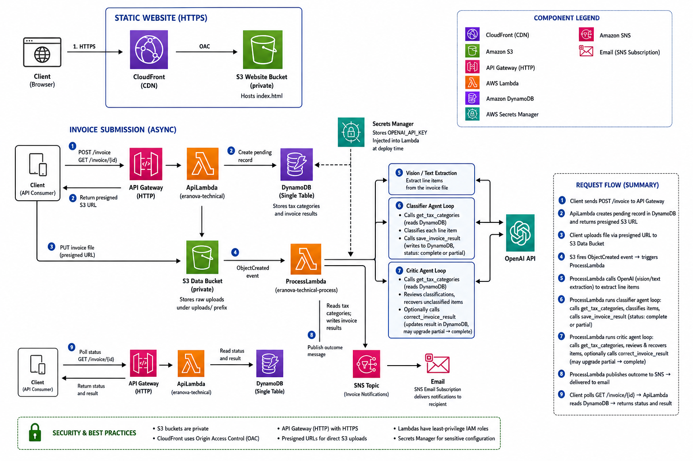

# Tax Line AI

This project is an agentic invoice tax classification system. A user uploads an invoice (PDF, image, CSV, JSON), an AI agent reads it, figures out what each line item is, and assigns the right tax category to it. Results come back via email and are also queryable through the API.



## How it works

1. A `POST /invoice` request with the file's content type (and optionally the vendor name) returns an `invoice_id` and a presigned `upload_url`
2. The file is PUT directly to S3 using that URL, with a `Content-Type` header matching what was declared. The URL expires in 5 minutes. PDFs, images, CSVs, and JSON are all supported
3. The S3 upload triggers the processing agent automatically. It runs in three steps:
   - first it extracts all line items from the document (description, quantity, unit price, subtotal)
   - then it classifies each one against the tax categories stored in the database, calculating the tax owed per line
   - finally a critic agent reviews the classifications, fixes any obvious errors, and tries to recover any items that couldn't be classified
4. `GET /invoice/{id}` returns the current status - polling until it changes from `pending`
5. An email is sent when processing finishes

Status will be `complete`, `partial` (some items couldn't be classified), or `failed` (something went wrong, resubmit the invoice).

## Frontend

The `web/index.html` is a single static HTML file served from S3 + CloudFront. It implements the same POST → PUT → poll flow as the API:

1. Vendor name (optional) and invoice file are submitted via a form
2. The file is PUT directly to S3 using the presigned URL
3. The UI polls every 5 seconds and renders the result when processing finishes

## API Layer

### `GET /health`

Returns `{"status": "ok"}`.

### `POST /invoice`

Initiates an invoice submission and returns a presigned S3 URL that the client uses to upload the file directly.

**Request body:**

| Field | Type | Required | Description |
|---|---|---|---|
| `content_type` | string | yes | Type of the file to upload (`application/pdf`, `image/jpeg`, `image/png`, `text/csv`, `application/json`) |
| `vendor` | string | no | Vendor name — used in notifications and the result response. If omitted, the agent attempts to extract it from the document and uses that as a fallback. |

**Response `200`:**
```json
{
  "invoice_id": "inv_abc123",
  "upload_url": "https://s3.amazonaws.com/...",
  "expires_in": 300
}
```

The client must PUT the file to `upload_url` with a `Content-Type` header matching the declared `content_type` - URL expires in 5 minutes.

**Errors:**

| Status | Condition |
|---|---|
| `400` | `content_type` missing or request body is not valid JSON |
| `500` | DynamoDB write failed or presigned URL could not be generated |

### `GET /invoice/{id}`

Polls for the processing result until processing completes.

**Path parameter:** `id` — the `invoice_id` returned by `POST /invoice`.

**Response `200` — pending:**
```json
{ "invoice_id": "inv_abc123", "status": "pending" }
```

**Response `200` — complete:**
```json
{
  "invoice_id": "inv_abc123",
  "status": "complete",
  "vendor": "Acme Corp",
  "line_items": [
    {
      "description": "Organic Apples 5kg",
      "quantity": 10,
      "unit_price": 12.50,
      "subtotal": 125.00,
      "tax_category": "fresh_produce",
      "tax_rate": 0.0,
      "tax_amount": 0.0,
      "excluded": false
    }
  ],
  "subtotal": 125.00,
  "total_tax": 0.0,
  "total": 125.00
}
```

`vendor` is omitted if none was provided at submission and the agent could not extract one from the document. `line_items`, `subtotal`, `total_tax`, and `total` are omitted when `status` is `pending` or `failed`.

**Response `200` — partial:**

Some items could not be classified or had unreadable numeric fields. Items with `excluded: true` are omitted from the totals. A line item is excluded if `tax_category`, `quantity`, `unit_price`, or `subtotal` could not extracted/calculated correctly.

**Response `200` — failed:**
```json
{
  "invoice_id": "inv_abc123",
  "status": "failed",
  "error": "uploaded file does not appear to be an invoice"
}
```

Processing failed entirely — no result was saved. The invoice should be resubmitted.

**Errors:**

| Status | Condition |
|---|---|
| `404` | Invoice ID not found |
| `500` | DynamoDB read failed |

### `GET /invoice/{id}/file`

Redirects to the original uploaded file via a freshly-signed presigned S3 URL (valid for 15 minutes). Because the URL is generated on each request, the endpoint link itself never expires.

**Path parameter:** `id` — the `invoice_id` returned by `POST /invoice`.

**Response:** `302 Location: https://s3.amazonaws.com/...`

**Errors:**

| Status | Condition |
|---|---|
| `404` | Invoice ID not found |
| `500` | DynamoDB read failed or presigned URL could not be generated |

### `ProcessLambda`

**Trigger execution flow:**

1. S3 fires an `ObjectCreated` event; the handler extracts `invoice_id` from the key (`uploads/{invoice_id}`)
2. File bytes are read from S3; `content_type` is read from DynamoDB or S3 record
3. `agent.run()` runs the three-step agent loop (extract → classify → save result)
4. `agent.run_critic()` reviews and optionally corrects the saved result
5. An SNS notification is published with the final status, totals, and a link to the original file

**Error handling tiers:**

| Step | Failure behaviour |
|---|---|
| S3 read | Fatal — invoice marked `failed`, notification sent |
| `agent.run()` | Fatal — invoice marked `failed`, notification sent |
| `agent.run_critic()` | Non-fatal — warning logged, classifier result kept as-is |
| SNS notification | Non-fatal — warning logged, result in DynamoDB is unaffected |

## DynamoDB Schema

Single table: `tax-line-ai`. PK/SK design.

| PK | SK | Attributes |
|---|---|---|
| `TAXCAT` | `CAT#fresh_produce` | `name`, `rate` |
| `INVOICE#inv_abc123` | `METADATA` | `status`, `vendor`, `s3_key`, `content_type`, `created_at`, `updated_at` |
| `INVOICE#inv_abc123` | `RESULT` | `line_items`, `subtotal`, `total_tax`, `total` |
| `INVOICE#inv_abc123` | `CORRECTIONS` | `corrections`, `corrected_at` |

Tax categories are seeded from `data/tax_rate_by_category.csv` by `scripts/seed_categories.py`, which runs automatically as a post-deploy step.

## Source Layout

```
src/
├── handler.py      # ApiLambda entrypoint — dispatches API Gateway events to the right handler module by routeKey
├── presign.py      # POST /invoice — validates the request, writes a pending record to DynamoDB, and returns a presigned S3 upload URL
├── query.py        # GET /invoice/{id} — reads invoice status and result from DynamoDB and builds the response payload
├── file.py         # GET /invoice/{id}/file — generates a fresh presigned S3 URL on each request and returns a 302 redirect to the original file
├── process.py      # ProcessLambda entrypoint — reads the uploaded file from S3, drives the agent loop, and publishes the SNS outcome notification
├── agent.py        # three-step agent loop: GPT extraction (vision/text → structured line items), Agents SDK classifier (tool-use loop → DynamoDB), and critic (validation + correction)
├── repository.py   # all DynamoDB read/write operations; exports a repo singleton used across both Lambdas
└── models.py       # Pydantic models for extraction output, classifier input/output, tax categories, and critic corrections
```
